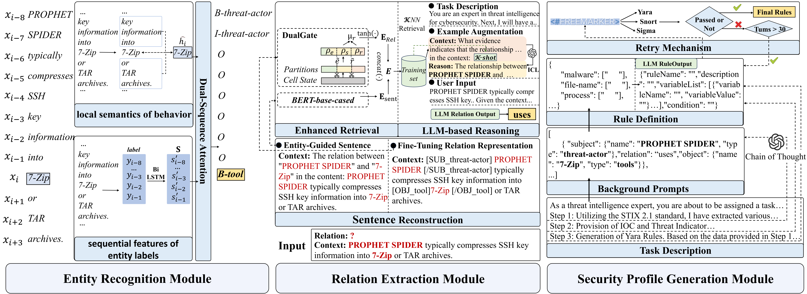

<div align="center">

<h1>A Knowledge Extraction Framework on Cyber Threat Reports with Enhanced Security Profiles</h1>
<h3>📢 News: this work has been accepted at the SIGIR 2025!</h3>
</div>


## Overview

Knowledge extraction on Cyber Threat Reports (CTRs) is critical for attack investigation and defenses. The granularity and the usability of the knowledge are key issues: the former is determined by entity recognition on CTRs, whereas the latter mainly depends on proper relation extraction. Nevertheless, in the state-of-the-art entity recognition methods on CTRs using span representation, the local semantics of behavior are not considered and the sequential features of entity labels within behavior descriptions are not utilized. Besides, domain-specific definitions/forms of the relation types and knowledge representations are also crucial for effective utilization of knowledge. In this paper, we propose a novel knowledge extraction framework on CTRs to address the above concerns. The framework is formed by the Enhanced Security Profiles (ESP) that can be directly utilized by security detection devices. In the ESP framework, we propose 3 modules to facilitate fine-grained and accurate knowledge extractions: (1) The entity recognition module utilizes a label-aware subsequence autoregressive algorithm to integrate local semantic and label sequence features, enabling accurate identification of cybersecurity entities; (2) The relation extraction module employs LLM-based strategies with shared partition representations to enhance semantic understanding and domain relevance; and (3) The security profile generation module leverages Chain-of-Thought reasoning and In-Context Learning to produce machine-readable rules executable in security detection systems. Extensive experiments on 6 datasets demonstrate that the ESP framework largely outperform the state-of-the-art solutions e.g., the Micro-Fl scores on entity recognition and relation extraction are at least 1.54% and 13.12% better, respectively. 




## Requirements

- Python 3.7.16
- PyTorch 1.13.1
- Transformers 4.24.0
- Pandas 1.3.5
- Numpy 1.21.5

We use a Linux platform with A6000 GPU to train our model.


## Datasets

- **DNRTI**: The DNRTI dataset is in the path `entity_recognition_module/data/DNRTI` and is divided into training set, validation set, and test set. Data can be downloaded from [link](https://github.com/LiuPeiP-CS/NER4CTI/tree/main/DNRTI_Dataset).
- **MalwareTextDB**: MalwareTextDB dataset in path `entity_recognition_module/data/MalwareTextDB`, divided into training set, validation set and test set. Data can be downloaded from [link](https://github.com/LiuPeiP-CS/NER4CTI/tree/main/MalwareDB/MalwareDB).
- **ADE**: ADE dataset in path `relation_extraction_module/data/ADE`, divided into training set and test set.
- **SciERC**: SciERC dataset in path `relation_extraction_module/data/SciERC`, divided into training set and test set.

- <span style='color: red'>**$Enterprise_{ER}$ & $Enterprise_{RE}$** : The Enterprise dataset has been withheld for corporate privacy reasons.</span>

- glove.6B.300d.txt: https://www.kaggle.com/datasets/thanakomsn/glove6b300dtxt
- glove.6B.50d.txt: https://www.kaggle.com/datasets/watts2/glove6b50dtxt


## Reproduce

### 1. Entity Recognition Module 

##### Model Training Commands

The main entry point is `main.py`. Example command:

```python
python main.py \
  --exp_name ESP_experiment \
  --exp_id ESP_experiments_logs \
  --logger_filename ESP_log.log \
  --dump_path experiments \
  --model_name bert-base-cased \
  --seed 7777 \
  --dataset_name DNRTI \
  --ner_train_data_path ner_data/%s/train.txt \
  --ner_dev_data_path ner_data/%s/dev.txt \
  --ner_test_data_path ner_data/%s/test.txt \
  --batch_size 64 \
  --epoch 120 \
  --shuffle True \
  --lr 3e-5 \
  --early_stop 20 \
  --num_tag 27 \
  --pos_tag_num 18 \
  --pos_embedding_dim 100 \
  --hidden_dim 768 \
  --save_path src/model/ESP/dim_768/ \
  --ESP True \
  --target_embedding_dim 50 \
  --target_type LSTM \
  --target_sequence True\
  --connect_label_background True\
  --n_layer 2 \
  --windows 7
```

**Hyperparameters:**

- `--exp_name`: The experiment name, which defaults to ESP_experiment, will be used as the root directory of the log file.
- `--exp_id`: As the id of one of the experiments under the `--exp_name` experiment, a folder named `--exp_id` will be created under the `--exp_name` folder, which will hold the log files for this `--exp_id` experiment.
- `--logger_filename`: This is used to specify the name of the log file. It will be placed under `exp_name`/`exp_id`.
- `--model_name`:  Pre-trained language model name.
- `--seed`: seed a random number.
- `--dataset_name`: The name of the dataset to select the corresponding dataset in the program.
- `--ner_train_data_path`, `--ner_dev_data_path`, `--ner_test_data_path`: The path used to find the dataset corresponding to the training, validation, and testing of the dataset.
- `--batch_size`,`--epoch`,`--shuffle`,`--lr`,`--early_stop`, `--dropout`: Base configuration for model training, which can be adapted to your own situation.
- ` --num_tag`: Number of types of data in the dataset after conversion to BIO tags.
- `--pos_tag_num`: The number of lexical types, this parameter is generally unchanged.
- `--pos_embedding_dim`: Specify the dimension of the embedding vector for lexical labels, which can be changed to suit your needs.
- `--hidden_dim`: Specify the dimensions of the word vector, which can be changed to suit your needs.
- `--save_path`:  Save the path of the best model during training.
- `--ESP`: Select the corresponding model type, this can contain `["ESP", "bigru", "bilstm", "crf"]` and so on.
- `--target_embedding_dim`: The dimension of the label embedding vector, which can be changed to suit your needs.
- `--target_type`: This is the type of context inside the proposed label, you can choose `LSTM` or the rest of the way.
- `--target_sequence`,`--target_sequence`: A control variable for the model architecture, which allows to choose whether to use labeled features or whether internal learning of labels is required.
- `--n_layer`: Controlling the number of layers in an `LSTM` or `GRU`.
- `--windows`: The variable that controls the length of the subsequence can be changed to suit your needs.

##### Example 

An example of using shell scripts to run the experiments in the paper:

```shell
#!/bin/bash
dims=(3 5 7 9 11 13)
for dim in "${dims[@]}"
do
	save_path="path"
    if [ ! -d "$save_path" ]; then
        mkdir -p "$save_path"
    fi
    python main.py \
    --ESP=True \
    --logger_filename=ESP_${dim}.log \
    --epoch=60 \
    --num_tag=27 \
    --hidden_dim="768" \
    --save_path="${save_path}" \
    --windows="${dim}" \
    --tgt_dm=DNRTI
done
```


### 2. Relation Extraction Module

##### Data Introduction

The data set of this module is in the `data` directory. Due to the size limit of the warehouse, we provide a part of the data set as a demo.
`total_re_task_data_list.pt` stores the data we have processed. The data structure in this file is a `List[ReSentBaseData]`.

```json
Data Example:
{
  'fine_tuned_re_model_tokens': ['[OBJ_TASK]', 'Recognition', 'of', 'proper', 'nouns', '[/OBJ_TASK]', 'in', 'Japanese', 'text', 'has', 'been', 'studied', 'as', 'a', 'part', 'of', 'the', 'more', 'general', 'problem', 'of', '[SUB_TASK]', 'morphological', 'analysis', '[/SUB_TASK]', 'in', 'Japanese', 'text', 'processing', '(', '[', '1', ']', '[', '2', ']', ')', '.'],
  'head_entity': {
  	'eneity_name': 'Recognition of proper nouns',
  	'entity_name_list': ['Recognition', 'of', 'proper', 'nouns']
  }
  'reconstructed_sent': 'The relation between "Recognition of proper nouns" and "morphological analysis" in the context: "Recognition of proper nouns in Japanese text has been studied as a part of the more general problem of morphological analysis in Japanese text processing ( [ 1 ] [ 2 ] ) ."'
  'relation_type': 'Part-of',
  'sent': 'Recognition of proper nouns in Japanese text has been studied as a part of the more general problem of morphological analysis in Japanese text processing ( [ 1 ] [ 2 ] ) .',
  'sent_token_list': ['Recognition', 'of', 'proper', 'nouns', 'in', 'Japanese', 'text', 'has', 'been', 'studied', 'as', 'a', 'part', 'of', 'the', 'more', 'general', 'problem', 'of', 'morphological', 'analysis', 'in', 'Japanese', 'text', 'processing', '(', '[', '1', ']', '[', '2', ']', ')', '.']
  'tail_entity': {
  	'eneity_name': 'morphological analysis',
  	'entity_name_list': ['morphological', 'analysis']
  }
}

```

##### Run training and classification

You can run `main.py` directly to copy our **Relation Extraction Module** module, but pay attention to our execution flow.

First, here is how to transform the initial data into the data we use to train DualGate.

```python
p_obj = ProcessTrainDataTemplate(total_re_task_data_list, params)
p_obj.do_process()
```

Then, we train our DualGate, which is developed based on [pfn][https://github.com/Coopercoppers/PFN].

```python
rain_re_model(params, root_dir)
```

Then, we trained a kNN model. The second and third lines here provide a demo of the knn detection performance.

```python
knn_obj = KnnRetrievalTemplate(total_re_task_data_list, params)
# search_sent_data = knn_obj.source_data_list[105]
# similar_sent_data = knn_obj.do_find_similar_sent(search_sent_data)  # type: List[IdentifiedReSentBaseData]
```

Finally, we get the final relationship extraction result through LLM.

```python
llm_re_obj = LLM_RE(params)
ans = llm_re_obj.do_llm_search(search_sent_data, similar_sent_data)
print(ans)
```

### 3.Security Profile Generation Module

The `data` directory stores the txt files of the rewritten text.

The `reports` directory contains all the data of the 10 case studies, including the intelligence sources, original intelligence texts, rules manually written by experts, rules automatically generated by ESP, etc.

`prompt` stores the main prompt words for generating the three rules.
